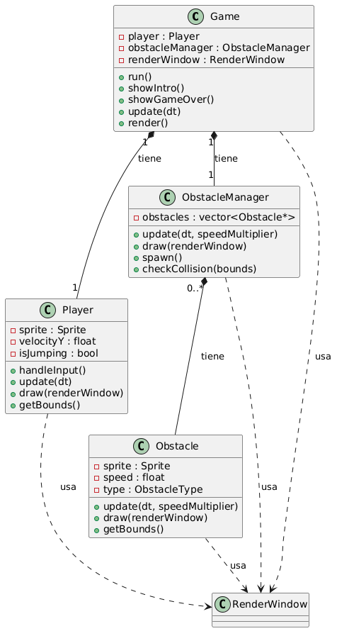

# Introducción

**QuicoChrome** es un juego desarrollado en C++ utilizando la librería **SFML**. Está inspirado en el popular juego DinoChrome, pero protagonizado por Quico, quien debe saltar y esquivar obstáculos como barriles y papalotes. El juego incluye imágenes, animaciones, sonidos y una pantalla de Game Over.

## Estructura de Carpetas

/docs       # Documentación y diagrama UML
/include    # Archivos .hpp (headers) de cada clase
/resources  # Imágenes, sonidos, fuentes
/src        # Archivos .cpp (implementación)

## Uso del Makefile

El proyecto incluye un archivo `Makefile` que facilita la compilación y ejecución del juego. Para utilizarlo, abre una terminal en la carpeta del proyecto y ejecuta los siguientes comandos:

- `make` compila el proyecto.
- `make run` ejecuta el juego.
- `make clean` elimina los archivos generados durante la compilación.

## Diagrama de Clases

El siguiente diagrama UML muestra la estructura y relaciones principales del proyecto:

## Características

- Movimiento y salto de Quico
- Obstáculos animados (barril y papalote)
- Imágenes y sonidos personalizados
- Pantalla de inicio e imagen de Game Over
- Score en pantalla

## Créditos

Desarrollado por Liliana Giselle Morales Bejarano 
Inspirado en DinoChrome y El Chavo del 8
